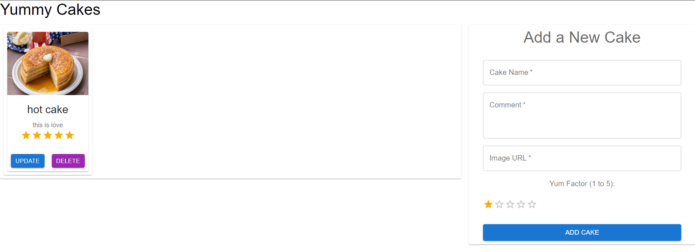

# cake-lover-app-suite

The Cake Lovers App Suite is a full-stack web app for cake enthusiasts to view, add, edit, and delete favorite cakes. Built with React (frontend) and Node.js/Express (backend) using MongoDB, it offers a responsive design, real-time updates, validation, and PWA capabilities for offline access.

## Frontend [frontend repository](frontend/README.md)

## Backend [backend repository](backend/README.md)
